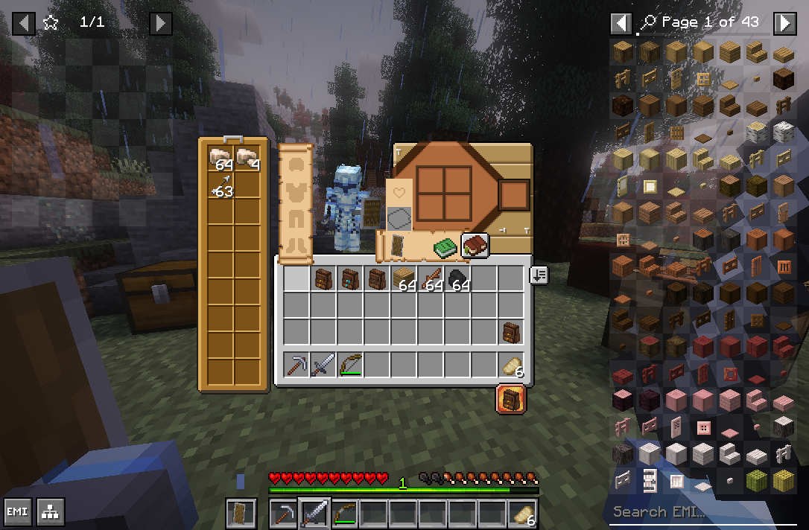
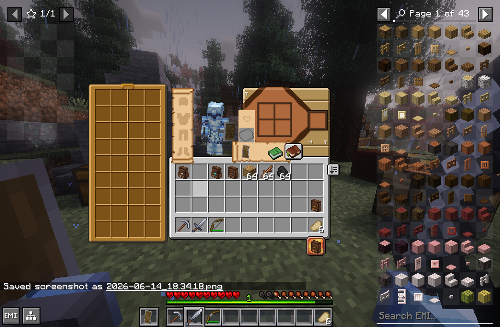
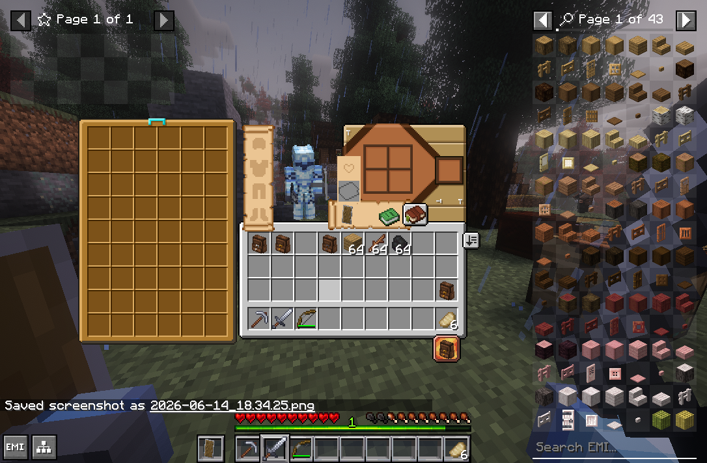

# Colourful Containers - YYZ Backpacks Compat

A resource pack that applies the **Colourful Containers** chest colour theme to **YYZ Backpacks** container GUIs.

## What it does

Replaces the default grayscale YYZ Backpacks GUI textures (`backpack.png`, `2x9backpack.png`, `4x9backpack.png`, `6x9backpack.png`, and `slot.png`) with recoloured versions using the warm brown/gold palette from Colourful Containers' chest variant with some custom detail.

## Screenshots

### Iron Backpack

### Gold backpack

### Diamond/Netherite Backpack
> Note: Currently the mod uses the same layout for both

## Installation

1. Download the latest `.zip` from releases
2. Place it in your `resourcepacks` folder
3. Enable in Minecraft and move **above** the default YYZ Backpacks assets in the pack list
4. Use alongside the main Colourful Containers and Modded Containers packs

## Requirements

- [YYZ Backpacks](https://modrinth.com/mod/yyzsbackpack) mod
- [Colourful Containers](https://modrinth.com/resourcepack/colourful-containers) resource pack

---

> This is a fan creation and is not affiliated with, endorsed by, or associated with the authors of YYZ Backpacks or Colourful Containers. All rights belong to their respective owners.
